# Grade Management System

A full-fledged (mostly) java grade management system that handles student records, subjects, exams, mark histories, grade computation, semester promotion, CSV-based persistence and performance benchmarking all using custom data structures and algorithms.

Built entirely from scratch using **handcrafted data structures and algorithms** - including a custom HashMap, Stack, Doubly Linked List, and iterative Merge Sort.

## Dependencies

- Java 11+
- Python with `matplotlib` installed for benchmark plotting

## How to run?

```bash
javac -d out -sourcepath app/src/main/java app/src/main/java/gms/App.java
java -cp out gms.App
```

## How to benchmark?

```bash
javac -d out -sourcepath app/src/main/java app/src/main/java/gms/App.java
java -XX:+UnlockExperimentalVMOptions -XX:+UseEpsilonGC -XX:+AlwaysPreTouch -cp out gms.App # Disable GC for stable memory usage statistics
```

## Features

### Custom Data Structures & Algorithms

- Custom-built:
  - **Doubly Linked List** (with head & tail pointers)
  - **Stack using Linked List** (push, pop, peek in O(1))
  - **HashMap with chaining** (custom hashing + collision handling)
  - **Iterative Merge Sort for Linked Lists**
- Every core academic feature (marks, history, sorting, rollback, persistence) is powered using these self-implemented structures.

Discussed in depth at [dsa.md](docs/dsa.md)

### Student & Subject Management

- Add / Remove Students
- Add / Remove subjects per semester
- View all students sorted by their CGPA using **iterative merge sort** for **a double ended linked list**
- View individual student details and subjects

### Examination Workflow

| Exam Order         | Action                                |
| ------------------ | ------------------------------------- |
| CAT1               | Enter marks for all students          |
| CAT2               | Enter marks after CAT1                |
| FAT                | Enter marks after CAT2                |
| Semester Promotion | Student gets prmoted to next semester |

After each exam you can revaluate the marks for a student, and you can rollback an invalid revaluation.

### Academic Progress

- Mark history stored using a **stack** (push & rollback) implemented using a **double ended linked list**
- Automatic SGPA and CGPA calculation
- Student promotion to next semester
- Report card generation per semester

### Data Persistence

- Saves and Loads:
  - Student data
  - Subjects
  - Marks history
  - SGPA & CGPA
  - Exam flow state
- Stored in CSV file format under `data/` folder

### Performance Benchmarking

- Benchmarks:
  - Revaluating (`PushMark`)
  - Rolling back a revalutaion (`RollbackMark`)
  - Getting the latest mark for report card generation (`LatestMark`)
  - Displaying revalutaion (marks) history (`HistoryTraversal`)
  - Iterative merge sort on students by CGPA
- Outputs to `benchmarks.csv` for easy analysis
- Plots using `matplotlib` and Python

## Project Architecture Overview

```monospace

gms
│
├── App.java             -> Starts the application & loads CSV data
│
├── cli/                 -> Handles user interaction
│   └── CLI.java         -> Menu, input handling, calls core logic
│
├── core/                -> Main business logic
│   ├── Institute.java   -> Manages students, semesters & exam phases
│   ├── Student.java     -> Holds subjects, marks, SGPA/CGPA calculations
│   ├── Subject.java     -> Stack of marks per exam (CAT1, CAT2, FAT)
│   ├── Exam.java        -> Enum for exam types
│
├── dsa/                      -> Custom Data Structures + Algorithms
│   ├── DoublyLinkedList.java -> Custom List<T> implementation using a double ended linked list
│   ├── Stack.java            -> Stack using double ended linked list
│   ├── HashMap.java          -> Own Map implementation
│   └── MergeSort.java        -> Merge sort for linked list
│
├── io/                         -> File input/output & persistence
│   ├── CSV.java                -> Generic CSV reader/writer
│   └── PersistenceManager.java -> Save/load students, subjects, marks
│
└── utils/
    └── Benchmark.java  -> Analytical benchmarking for operations
```

## Menu Overview

The menu with all the options. Some of these options are hidden based on context/state.

```monospace
1. Add Student
2. Remove Student
3. View All Students (Sorted by CGPA)
4. View Student Details
5. Add Subject
6. Remove Subject
7. Enter Exam Marks (CAT1 → CAT2 → FAT → Promote)
8. Update Marks (Revaluation)
9. Rollback Last Marks
10. Show Student Report
11. Show Subject Marks History
12. Save Data
13. Delete Data
14. Exit
```

## Benchmarks


| Functionality                                                  | Data Structure                              | Time Complexity | Space |
| -------------------------------------------------------------- | ------------------------------------------- | --------------- | ----- |
| Add Subject                                                    | HashMap                                     | O(1)            | O(1)  |
| Revaluation (`PushMark`)                                       | Custom Stack                                | O(1)            | O(1)  |
| Rolling back a revalutaion (`RollbackMark`)                    | Custom Stack.pop()                          | O(1)            | O(1)  |
| Latest mark retrival for report card generation (`LatestMark`) | Custom Stack.peek()                         | O(1)            | O(1)  |
| Revalutaion history display (`HistoryTraversal`)               | Stack Traversal                             | O(n)            | O(1)  |
| Sort Students by CGPA for display                              | Custom Iterative Merge Sort for Linked List | O(n log n)      | O(1)  |
| HashMap Get/Put/Remove used for Student/Subject management     | Custom HashMap                              | O(1)            | O(1)  |

## Test Cases

Demonstrated below are some sample test cases. 5 successful test cases and 1 failure test case. The application is not just limited to these workflows but these ones have been demonstrated here as they are the most popular ones.

### Success - Add Initial Student, Add Subject and View Student Details

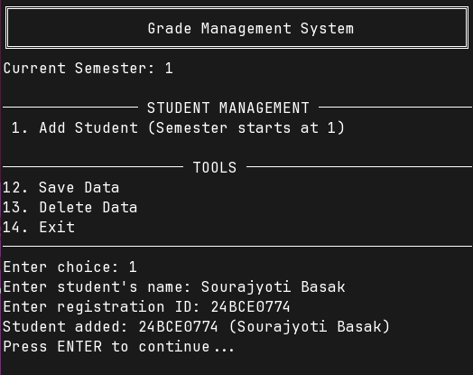

Adding initial student to the system.

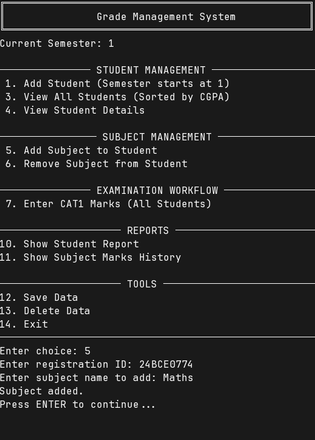

Adding a subject to the student. You can add multiple subjects to students, but adding only one subject has been demonstrated here for simplicity.


Viewing student details

### Success - Adding another student and entering CAT1 Marks

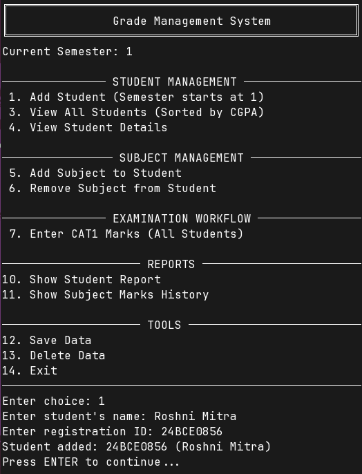

Adding second student to the system.

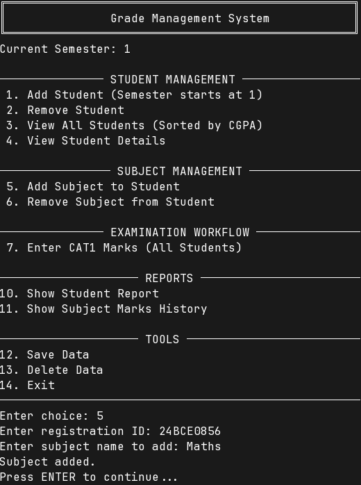

Adding a subject to the new student.

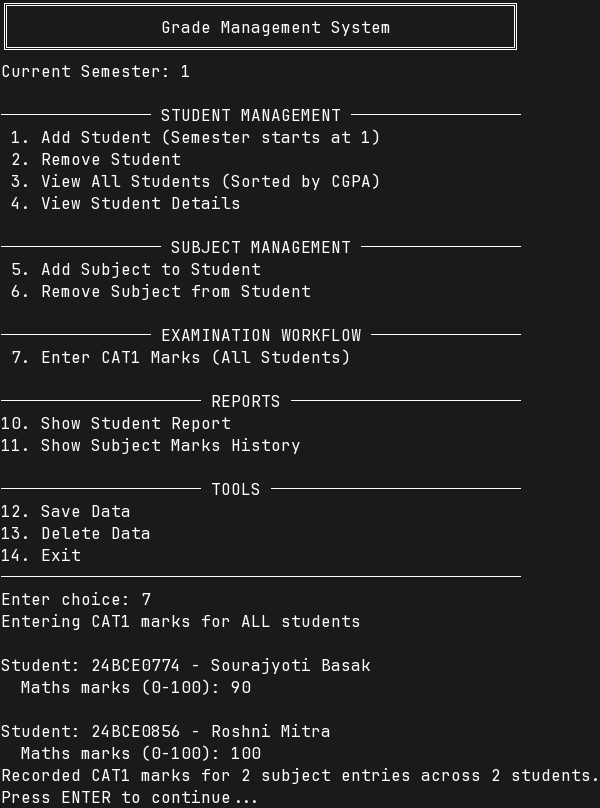

Entering CAT1 marks for all students. After which the "add students" option is removed as you can only add students at the beginning of semesters.


Viewing report card for first student.

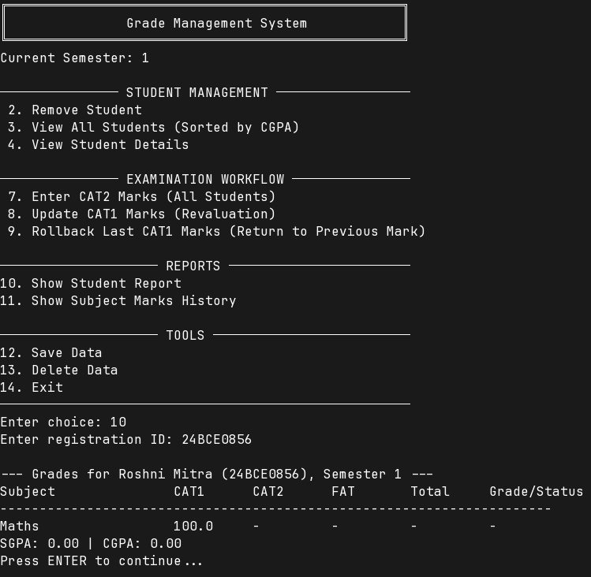

Viewing report card for second student.

### Success - Revaluation and Rollback

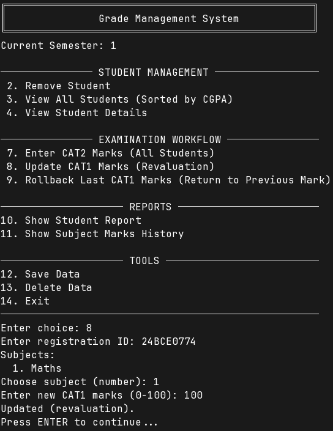

Revaluating the last exam (CAT1's) marks for a student.

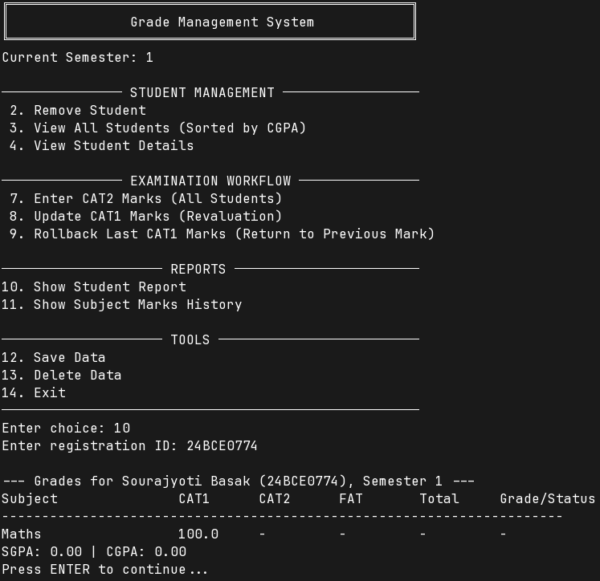

Report display shows the updated marks.

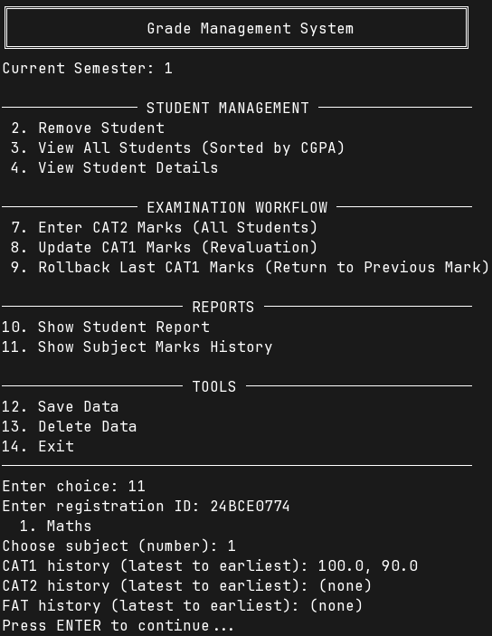

Marks history display for a subject.

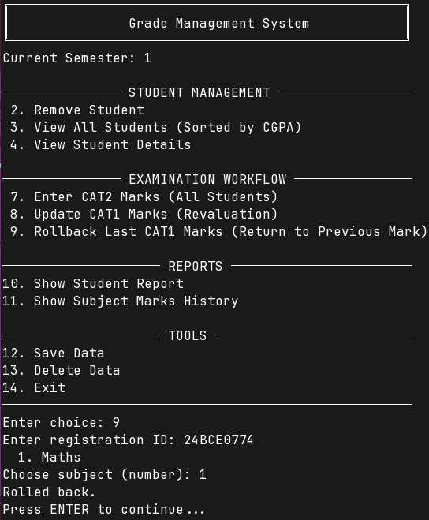

Rolling back a revaluation. Only done if the teacher wants to revert to the previous mark before the latest revaluation. Deletes that mark from the history.

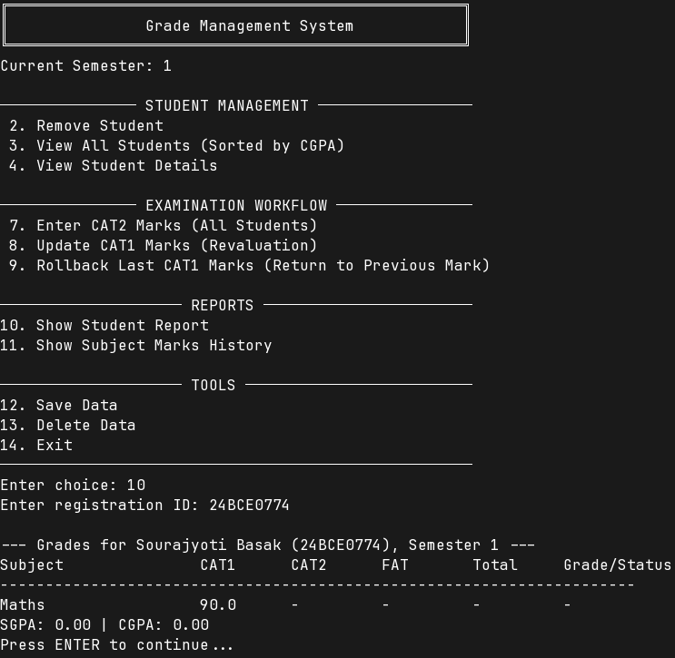

Report card now displays previous mark.

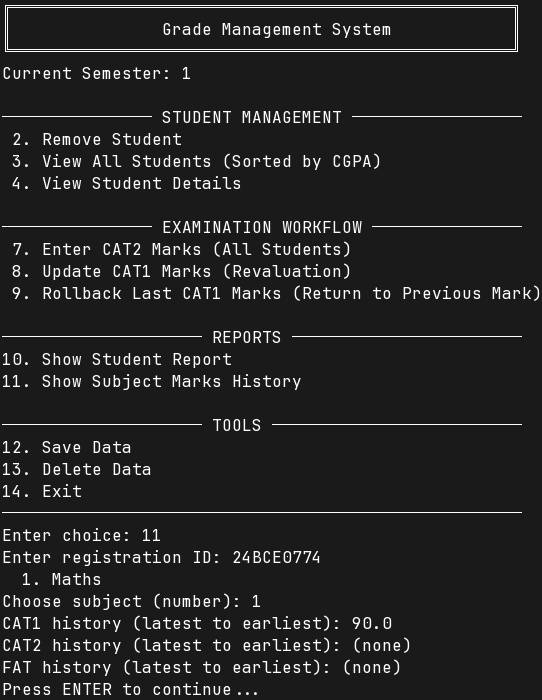

The rolled back revaluated marks is removed from mark history.

### Success - Entering CAT2 and FAT marks and promoting students to next semester

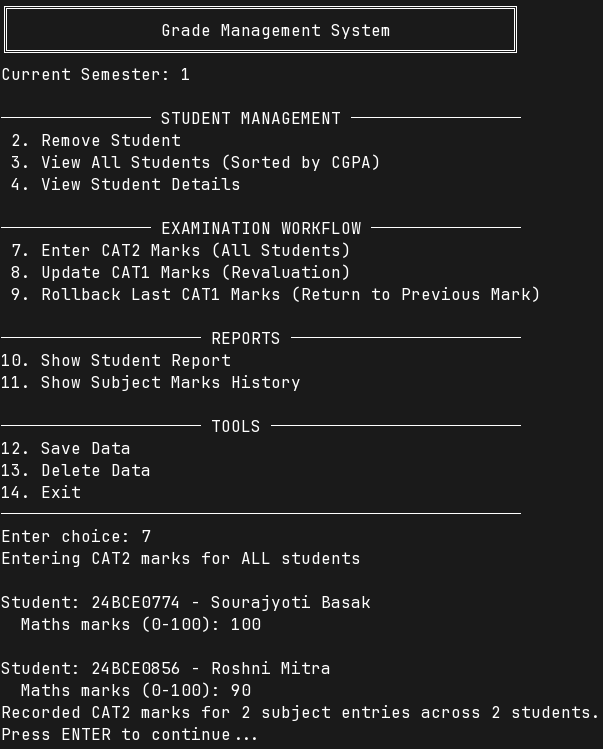

Adding CAT2 marks for all students.

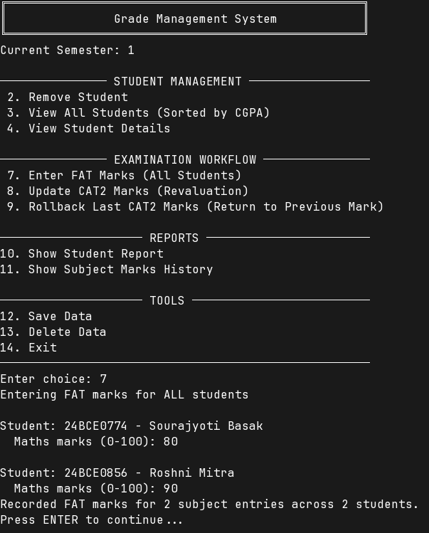

Adding FAT marks for all students.

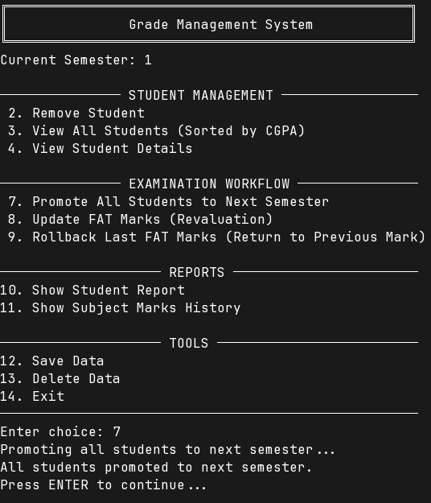

Promoting all students. Advances current semester.

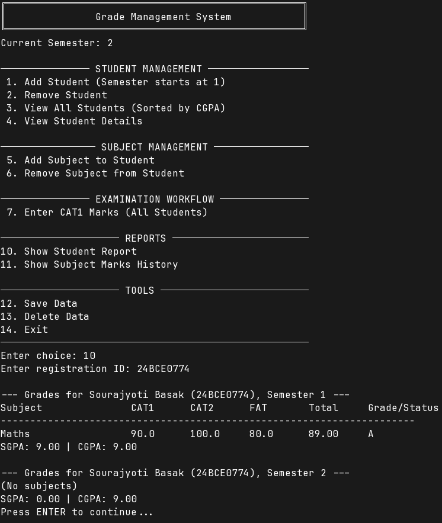

Displaying first student's report card. You can also have added another student in this semester (that student's semester starts from 1), while the other older students continue with semester 2.

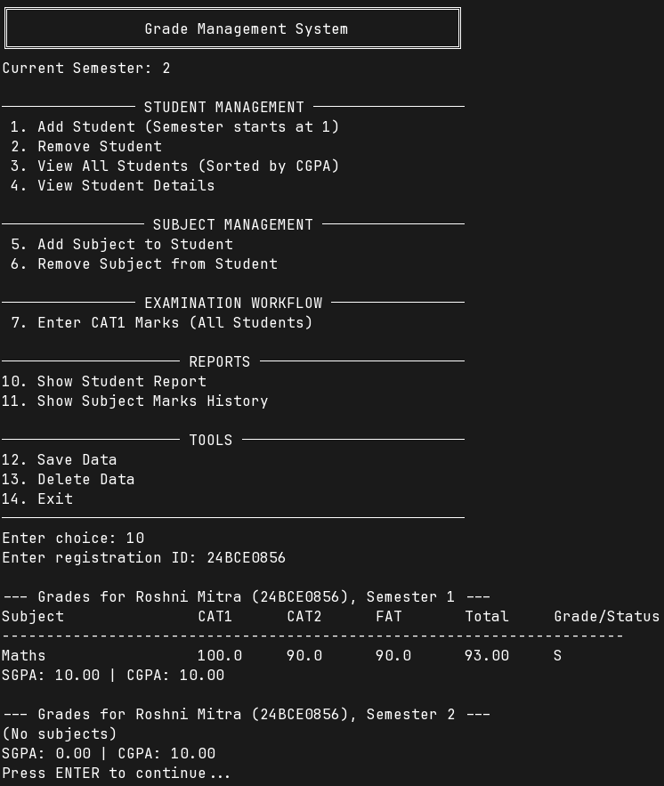

Displaying second student's report card.

### Success - Saving and Loading State

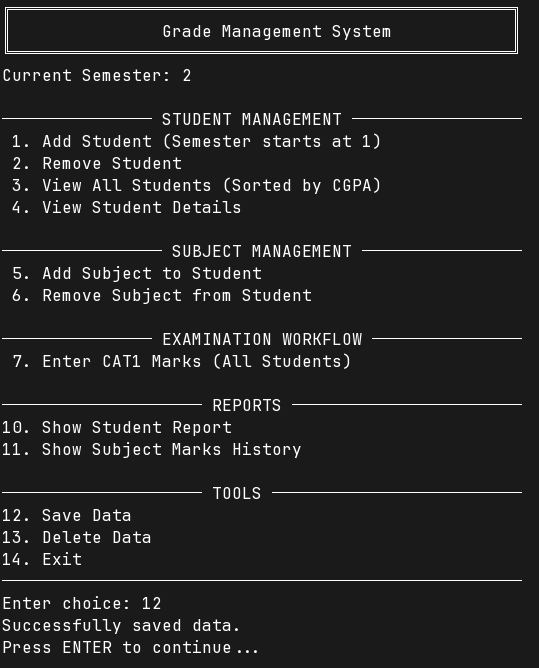

Saves the state in form of CSVs.


Exiting from the system.

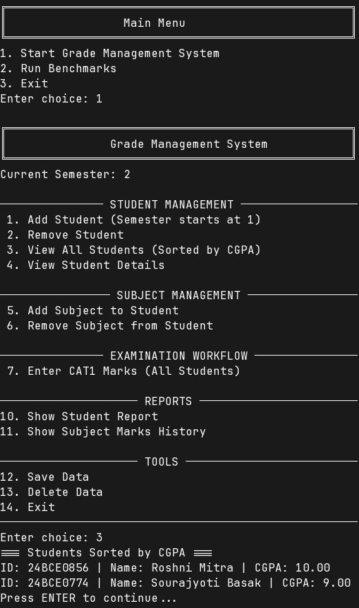

Entering the system back again and verifying that the data has been restored.

### Failure - Trying to remove an invalid student

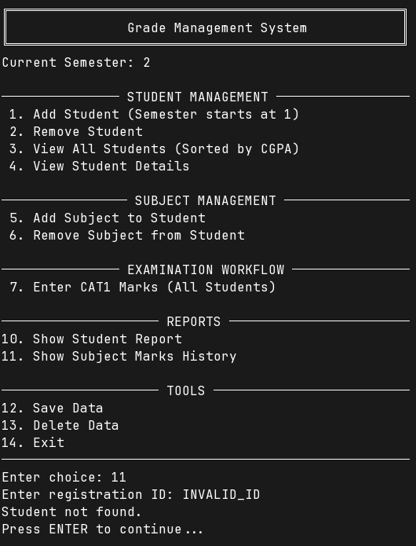

Fails to remove an invalid student.

## Future Enhancements

- Concept of failing a student, holding them back for a semester.
- Credits weightage per subject.
- GUI-based interface (JavaFX or Swing)
- Export reports to PDF
- Add authentication for admin access
